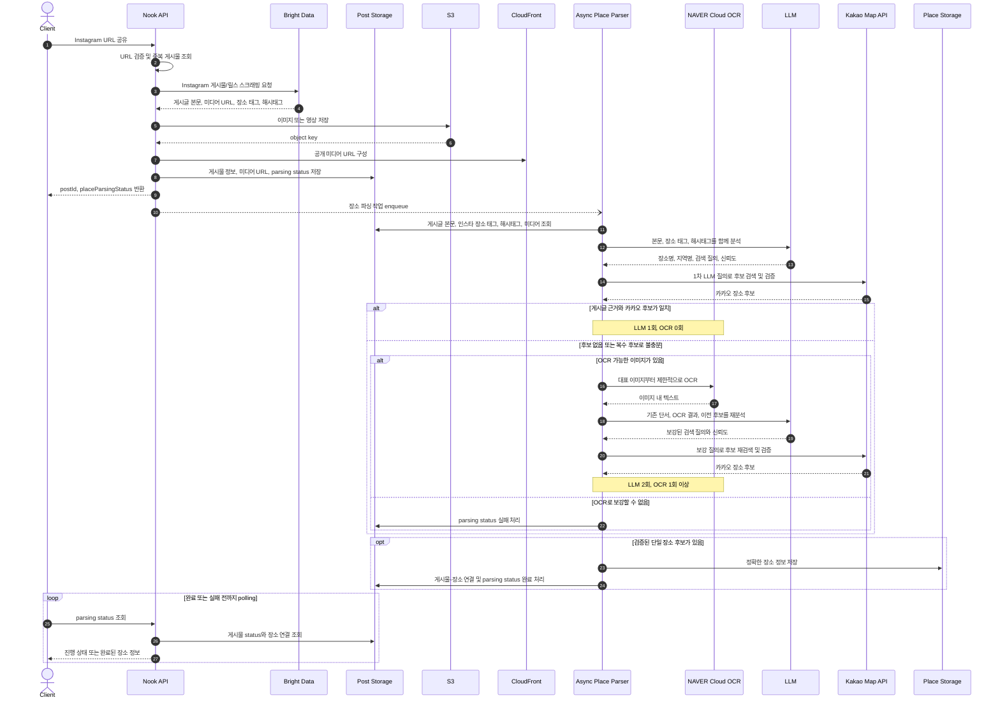

# NOOK-17 Instagram 공유 기반 게시물·장소 생성 흐름 문서화

## 목적

클라이언트가 공유한 Instagram URL을 입력으로 받아 게시물 저장, 미디어 스토리지 저장, 비동기 장소 파싱,
카카오 맵 기반 장소 확정, polling 응답까지 이어지는 전체 흐름을 정리합니다.

각 작업자가 동일한 처리 순서와 책임 경계를 기준으로 게시물·장소 생성 기능을 구현할 수 있게 하는 것이
목적입니다.

## 범위

- Instagram URL 공유부터 장소 정보 완성까지의 처리 흐름 다이어그램
- 동기 처리와 비동기 처리 경계
- Bright Data, S3/CloudFront, OCR/LLM, Kakao Map API의 역할
- 게시글 텍스트와 장소 태그의 교차검증, OCR 보강의 단계적 실행 기준
- OCR와 2차 LLM 호출의 비용·지연 판단 기준과 관측 지표
- 게시물 저장, 미디어 저장, 장소 파싱, 장소 확정, polling status 제공 책임
- 후속 구현에서 확정해야 할 API 계약과 상태 값

## 제외 범위

- API endpoint 구현
- DB 스키마 변경
- Bright Data, OCR, LLM, Kakao Map API 실제 연동 코드
- worker, queue, retry 인프라 구현
- parsing status와 응답 스키마의 최종 확정

## 전체 흐름



## 처리 경계

### 동기 처리

클라이언트의 공유 요청 안에서 다음 작업을 완료합니다.

- Instagram URL 형식과 지원 범위를 검증합니다.
- 동일 출처와 외부 게시물 ID 기준으로 기존 게시물이 있는지 확인합니다.
- Bright Data를 통해 게시글 정보와 미디어 원본 URL을 스크래핑합니다.
- 이미지 또는 영상을 S3에 저장하고 CloudFront로 접근 가능한 URL을 구성합니다.
- 게시물 본문, 원본 출처, 미디어, Instagram 장소 태그, 해시태그를 저장합니다.
- 장소 파싱 상태를 초기 상태로 저장하고 비동기 장소 파싱 작업을 등록합니다.
- 클라이언트에는 게시물 식별자와 장소 파싱 상태를 반환합니다.

Bright Data 호출과 미디어 다운로드는 외부 provider 호출이므로 DB 트랜잭션 안에서 실행하지 않습니다.
provider 응답과 스토리지 저장 결과를 확보한 뒤, 게시물 저장과 작업 등록만 짧은 트랜잭션으로 처리합니다.

### 비동기 처리

장소 정보는 공유 요청 응답 이후 별도 작업으로 완성합니다.

- 저장된 게시글 본문, Instagram 장소 태그, 해시태그, 미디어 URL을 읽습니다.
- 본문, 장소 태그, 해시태그를 항상 1차 LLM 입력으로 함께 사용합니다.
- 장소 태그는 작성자가 선택한 보조 단서일 뿐 단독 확정 근거로 사용하지 않습니다.
- 1차 LLM이 생성한 장소명, 지역명, 검색 질의로 카카오 후보를 조회하고 텍스트 근거와 일치하는지 검증합니다.
- 1차 결과로 확정할 수 없고 OCR 가능한 이미지가 있을 때만 대표 이미지부터 OCR을 실행합니다.
- 기존 텍스트, OCR 결과, 1차 카카오 검색 결과를 2차 LLM 입력으로 함께 전달해 질의를 보강합니다.
- 보강된 질의로 카카오 후보를 다시 검증하고 좌표와 provider 장소 ID를 확보합니다.
- 확정된 장소를 저장하고 게시물과 장소를 연결합니다.
- 처리 결과에 따라 parsing status를 완료 또는 실패로 갱신합니다.

LLM과 카카오 맵 API 호출도 DB 트랜잭션 바깥에서 실행합니다. 장소 저장, 게시물-장소 연결, status 갱신만
짧은 트랜잭션으로 묶습니다.

## 단계별 실행 정책

장소 태그가 있더라도 게시글의 실제 내용과 일치하는지 반드시 함께 확인합니다. 장소 파싱은 모든
게시물에 대해 텍스트 분석을 먼저 실행하고, 이미지 정보는 앞선 근거가 불충분할 때만 사용합니다.

| 단계 | 진입 조건 | 외부 호출 | 성공 조건 |
| --- | --- | --- | --- |
| 텍스트 분석 | 모든 게시물 | LLM 1회, Kakao 1회 | 본문·장소 태그·해시태그 근거와 일치하는 단일 후보 |
| 이미지 보강 | 후보가 없거나 복수이고 OCR 가능한 이미지가 있음 | OCR, LLM 1회 추가, Kakao 1회 추가 | OCR 근거까지 반영해 검증된 단일 후보 |
| 종료 | 이미지 보강 후에도 확정 불가 | 없음 | `FAILED` 또는 후속 사용자 확인 대상으로 전환 |

장소 태그나 신뢰도 숫자 하나만으로 장소를 확정하지 않습니다. 최소한 본문·장소 태그·해시태그를 종합한
LLM 결과의 장소명·지역과 카카오 후보의 장소명·주소가 일치해야 합니다. 장소 태그와 게시글 내용이
충돌하거나 여러 후보의 점수가 비슷하면 OCR 보강 또는 실패로 처리합니다. 임계값은 초기 운영 데이터로
조정할 수 있도록 설정값으로 관리합니다.

OCR은 모든 이미지를 한 번에 처리하지 않습니다. 대표 이미지 1장부터 시작하고, 이미지당 호출 비용과
지연을 고려해 최대 처리 장수를 설정합니다. 영상만 있는 릴스는 초기 범위에서 OCR 대상에서 제외하고,
프레임 추출은 별도 이슈에서 검토합니다.

## 비용과 지연

2026-07-25 기준 NAVER Cloud General OCR 글자 추출은 월 100회 무료, 이후 건당 3원이며 API Gateway
사용료가 별도로 발생합니다. 실제 비용은 이미지 장수만큼 증가하므로 가격을 코드에 고정하지 않고
[NAVER Cloud 공식 요금표](https://www.ncloud.com/charge/price/ko)를 운영 기준으로 확인합니다.

게시물 한 건의 평균 장소 파싱 비용은 다음 항목으로 추적합니다.

```text
평균 비용
= 1차 LLM + 카카오 검색
+ P(OCR 보강 진입) * (OCR 처리 이미지 수 * OCR 단가 + 2차 LLM + 카카오 재검색)
```

OCR 보강은 추가 호출 비용과 지연보다 장소 확정률 개선으로 줄어드는 실패·수동 확인 비용이 클 때
유지합니다. 초기에는 정확도를 위해 보수적으로 진입시키되, 운영 데이터에서 OCR이 최종 결과를 바꾸지
못하는 비율이 높으면 진입 조건과 최대 이미지 장수를 축소합니다.

다음 지표를 파싱 작업 단위로 기록합니다.

- `resolutionPath`: `TEXT_LLM`, `OCR_ENRICHED`
- `llmCallCount`, `ocrCallCount`, `ocrImageCount`, `kakaoSearchCount`
- 단계별 `processingDurationMs`와 전체 `processingDurationMs`
- `candidateCount`, `confidence`, `finalStatus`, `failureReason`
- OCR 전후 후보 변경 여부와 최종 장소 확정 여부

## 책임 분리

- `nook-api-presentation`: Instagram URL 공유 API와 polling API의 HTTP 요청·응답을 담당합니다.
- `nook-api-application`: 게시물 생성 유스케이스, 장소 파싱 작업 등록, polling 조회 유스케이스와 provider
  port를 소유합니다.
- `nook-api-domain`: 게시물, 미디어, 장소, parsing status의 프레임워크 독립 규칙을 표현합니다.
- `nook-api-infrastructure`: Bright Data, S3, CloudFront URL 구성, OCR, LLM, Kakao Map API, persistence adapter를
  구현합니다.
- `nook-api-batch` 또는 worker runtime: 등록된 장소 파싱 작업을 비동기로 실행합니다.

## Parsing status 후보

상태 값은 후속 API 계약 이슈에서 확정합니다. 현재 흐름 문서에서는 다음 후보를 기준으로 구현 범위를
나눕니다.

- `PENDING`: 게시물 저장은 끝났고 장소 파싱 작업이 등록되었습니다.
- `PROCESSING`: LLM 분석, OCR 보강, 카카오 검색 중 하나를 실행하고 있습니다.
- `COMPLETED`: 정확한 장소 정보 저장과 게시물-장소 연결이 끝났습니다.
- `FAILED`: 재시도 가능한 오류 또는 최종 실패로 장소를 확정하지 못했습니다.

polling API는 `COMPLETED`일 때 장소 정보를 함께 반환합니다. `PENDING`과 `PROCESSING`에서는 현재 상태와
게시물 식별자만 반환하고, `FAILED`에서는 공개 가능한 실패 사유를 반환할 수 있습니다.

내부 처리 단계는 `TEXT_ANALYZING`, `PLACE_SEARCHING`, `OCR_PROCESSING`, `PLACE_RETRYING`처럼
세분화해 관측할 수 있습니다. 클라이언트 공개 enum은 내부 단계와 분리해 `PENDING`, `PROCESSING`,
`COMPLETED`, `FAILED` 네 가지로 유지하면 처리 전략 변경이 API 호환성에 영향을 주지 않습니다.

## 미결정 사항

- 비동기 실행 방식을 batch polling, queue, scheduler 중 무엇으로 시작할지 결정해야 합니다.
- OCR 최대 이미지 장수와 이미지 선택 기준을 운영 데이터로 확정해야 합니다.
- 영상만 있는 릴스의 frame 추출은 초기 범위에서 제외하며, 지원 여부를 별도 결정해야 합니다.
- LLM 구조화 출력 스키마와 장소 확정 임계값을 정해야 합니다.
- 카카오 장소 후보가 여러 개이거나 없는 경우 사용자 확인 플로우가 필요한지 정해야 합니다.
- polling API의 status enum, 실패 코드, 완료 응답 필드를 확정해야 합니다.
- 같은 Instagram URL 재공유 시 기존 게시물 재사용과 사용자 저장 생성 규칙을 확정해야 합니다.

## 성공 기준

- 게시물 생성과 장소 생성 흐름을 하나의 다이어그램으로 이해할 수 있습니다.
- 동기 처리와 비동기 처리 경계가 명확합니다.
- 장소 태그가 있어도 본문과 해시태그를 포함한 1차 LLM 분석을 항상 실행합니다.
- 장소 태그를 단독 확정 근거로 사용하지 않습니다.
- 텍스트 분석으로 장소를 확정하면 OCR을 호출하지 않습니다.
- OCR과 2차 LLM은 앞선 단계로 장소를 확정할 수 없을 때만 호출합니다.
- 게시글 저장, 미디어 저장, 장소 파싱, 카카오 장소 확정, polling 응답의 책임이 분리되어 있습니다.
- 외부 provider 호출이 DB 트랜잭션 안에서 실행되지 않는다는 원칙이 문서에 반영되어 있습니다.
- 비용, 지연, OCR의 장소 확정 기여도를 측정할 지표가 정의되어 있습니다.
- 후속 구현 이슈에서 확정해야 할 미결정 사항이 문서에 남아 있습니다.

## 검증

```shell
git diff --check
```

문서 변경만 포함하므로 Gradle 검증은 필수로 보지 않습니다. 다만 이 흐름을 구현하는 후속 이슈에서는
변경 범위에 맞게 `./gradlew detekt`, `./gradlew test`, `./gradlew check`를 실행합니다.

## 배포 및 롤백

DB와 애플리케이션 런타임 변경은 없습니다. 문서 반영 후 문제가 있으면 해당 문서 변경 커밋을 되돌립니다.
